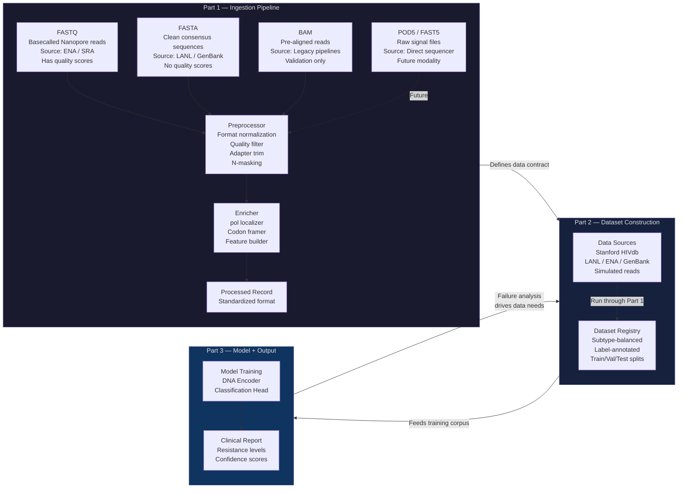
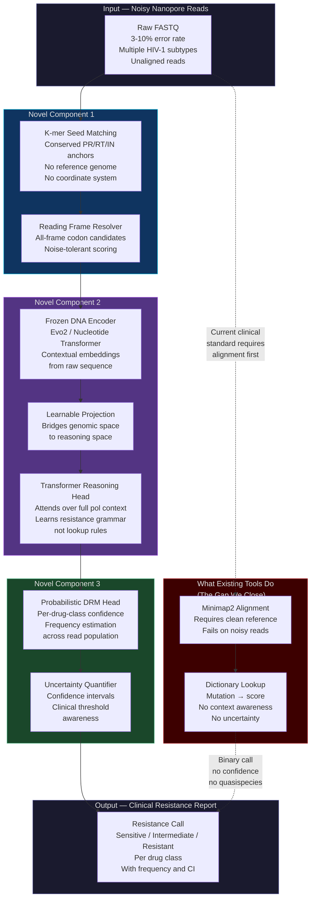

# Genomic-Transformer-Pipeline: System Architecture

**Project:** AI-Driven HIV Drug Resistance Mutation Detection  
**Lab:** Professor Weihua Guan's Lab  
**Approach:** Alignment-Free Inference on Noisy Nanopore Reads

---

## Project Thesis

Existing clinical tools for HIV Drug Resistance Mutation (DRM) detection require a completed reference-genome alignment before they can call a single mutation. This creates an irreducible latency floor, fails on reads that diverge from the HXB2 reference (non-B subtypes), and produces binary resistance calls with no uncertainty quantification. This pipeline replaces that workflow with a Transformer-based sequence reasoning engine that operates directly on raw, noisy Nanopore reads — no alignment required. The system is designed to be inherently robust to the 3–10% Nanopore error rate, generalize across HIV-1 subtypes, and produce probabilistic, quasispecies-aware resistance calls with clinical confidence intervals.

---

## 1. Build Order: How We Organize the Work

This diagram defines the three sequential phases of the project. It is the organizational scaffold — it tells us what to build, in what order, and how each phase depends on the previous one.



### Part 1 — Ingestion Pipeline

The ingestion pipeline is the data engineering layer. Its sole responsibility is to take any raw sequencing input and produce a clean, standardized, feature-rich record in a consistent format — regardless of where the input came from. It knows nothing about HIV biology. It knows about file formats, read quality, and feature extraction. The output of Part 1 is a **data contract**: a guaranteed record structure that every downstream component can rely on without needing to know anything about the source data.

The four input formats are not equivalent and come from different sources. **FASTQ** is the primary inference input — basecalled Nanopore reads from ENA or NCBI SRA, carrying per-base quality scores. **FASTA** is clean consensus sequences from LANL or GenBank with no quality information, used for training only. **BAM** is pre-aligned reads from legacy pipelines, used for validation and benchmarking against existing tools. **POD5/FAST5** are raw electrical signal files directly off the sequencer — before basecalling has happened — and represent a future input modality that would allow us to bypass basecalling error entirely. Almost all current public datasets are already in FASTQ form, so POD5/FAST5 is a north-star goal rather than an immediate requirement.

This phase is built first because it has no machine learning dependencies. It can be validated in complete isolation, which means we have a working, testable system from day one before a single model is trained.

### Part 2 — Dataset Construction

With the ingestion pipeline defined, Part 2 is where we go and collect from every relevant data source — Stanford HIVdb, Los Alamos HIV Database, European Nucleotide Archive, NCBI GenBank, and NanoSim-simulated reads — run each through the Part 1 pipeline, and assemble a curated, subtype-balanced, label-annotated training corpus. The scientific rigor of the entire project lives here. A model trained on a poorly constructed dataset will fail regardless of architectural sophistication.

The feedback arrow from Part 3 back to Part 2 is deliberate. Once the model is training, we will discover where it fails — perhaps on subtype C sequences, perhaps on reads with insertion-deletion errors. Those failure patterns drive targeted additions to the dataset, which requires returning to Part 2 and reprocessing through Part 1.

### Part 3 — Model and Output

With a validated data pipeline and a curated training corpus, Part 3 trains the model and wires up the clinical output layer. This is where the BioReason-inspired architecture lives: a frozen DNA encoder producing contextual embeddings, a learnable projection layer, and a lightweight Transformer reasoning head feeding a probabilistic DRM classification head. The output is not a binary mutation call — it is a resistance level (Sensitive / Intermediate / Resistant) per drug class, with frequency estimates and confidence intervals across the read population.

---

## 2. Research Contribution: What Is Technically Novel

The build-order diagram above describes *how* we organize the work. This diagram describes *what is new* — the three technical contributions that distinguish this system from every existing clinical DRM detection tool.



### Novel Component 1 — Alignment-Free pol Localization

Every existing clinical tool — Stanford HIVdb's Sierra pipeline, Geneious, PASeq, and the `hiv_drm_enricher` reference implementation — requires a completed alignment to HXB2 before it can call a single mutation. Alignment introduces a 10–20 minute latency floor, requires a reference FASTA on disk, and silently fails when reads diverge from the reference (as subtype A, C, D sequences routinely do by up to 12% at the nucleotide level).

We replace alignment with a lightweight k-mer seed matching step. A small set of highly conserved anchor sequences within the Protease, Reverse Transcriptase, and Integrase regions are used to localize whether a read plausibly originates from each gene region — without placing the read on any coordinate system. A reading frame resolver then evaluates all three possible codon frames and scores each against known *pol* codon distributions, producing frame-annotated codon candidates as output. This entire step runs on CPU, is independently testable, and adds no GPU dependency.

### Novel Component 2 — Noisy Sequence Reasoning

Current tools treat DRM detection as a **lookup problem**: align a read, find the codon at a known position, check it against a dictionary. This approach has no capacity for context — it cannot reason about whether a set of co-occurring mutations is consistent with a known resistance pathway, or whether a borderline codon change is more likely to be a true mutation or a sequencing error given the surrounding sequence context.

We treat DRM detection as a **reasoning problem**. A frozen, pretrained DNA foundation model (Evo2 or the Nucleotide Transformer) encodes the full enriched read into high-dimensional contextual embeddings that capture long-range sequence dependencies across the entire *pol* gene. A learnable linear projection bridges the DNA embedding space to the reasoning head's input dimension. A lightweight Transformer reasoning head then attends over the full sequence context to produce a resistance-relevant representation — one that has learned the "genomic grammar" of resistance, not a lookup rule.

This is directly inspired by the BioReason architecture, adapted and specialized for HIV DRM detection on Nanopore data.

### Novel Component 3 — Quasispecies-Aware Probabilistic Output

HIV exists in a patient not as a single sequence but as a swarm of related variants called a quasispecies. A resistance mutation present in 5% of viral copies is clinically significant for certain drug classes (NNRTIs) but not others (Protease Inhibitors). Current tools report mutations as present or absent based on majority-vote consensus across reads, discarding this frequency information entirely.

Our output layer pools predictions across all reads from a single sample to produce a per-drug-class resistance call with an associated variant frequency estimate and 95% confidence interval. The classification threshold is drug-class specific — reflecting established clinical evidence that different drugs have different minority-variant resistance barriers. This produces outputs of the form: "K103N detected at 23% frequency [CI: 18%–29%], exceeding the 20% NNRTI resistance threshold → Resistant" rather than a flat "K103N: Present."

---

## 3. Critical Architectural Boundary

The single most important design decision in this system is the **hard separation between the Enricher (Novel Component 1) and the Inference Engine (Novel Component 2)**. These two modules communicate only through the standardized Processed Record format defined by Part 1. Neither module knows anything about the other's internal implementation.

This boundary gives us three concrete engineering benefits. First, the Enricher can be validated independently — we can confirm it correctly localizes *pol* reads and resolves reading frames before any model is trained, giving us an early checkpoint on data quality. Second, on edge hardware (NVIDIA Jetson AGX Orin), the Enricher can run on CPU while the GPU handles inference in parallel, with the bounded memory of a streaming buffer rather than loading full BAM files into memory. Third, the Inference Engine's DNA encoder can be swapped — from Evo2 to Nucleotide Transformer, or to a future lighter architecture — without modifying the Enricher, the Output layer, or any other module.

---

## 4. Source Code Structure

The module boundaries above map directly to the following `src/` directory structure. Each file has a single, well-defined responsibility.

```
src/
├── ingestion/
│   ├── stream_reader.py        # FASTQ/FAST5 chunked streaming
│   └── quality_filter.py       # Q-score, length, adapter filtering
│
├── enricher/
│   ├── pol_localizer.py        # K-mer sketch pol gene detection
│   ├── codon_framer.py         # Reading frame candidate extraction
│   └── feature_builder.py      # Assembles enricher output payload
│
├── inference/
│   ├── dna_encoder.py          # Frozen Evo2/NT wrapper
│   ├── projection.py           # Learnable linear bridge
│   └── reasoning_head.py       # Lightweight transformer head
│
├── classification/
│   ├── drm_head.py             # Multi-label DRM classifier
│   └── confidence.py           # Uncertainty quantification
│
├── output/
│   ├── aggregator.py           # Read-level → sample-level pooling
│   └── report_generator.py     # JSON + clinical PDF output
│
├── training/
│   ├── dataset.py              # Dataset registry and loaders
│   └── trainer.py              # Training loop
│
└── config/
    └── pipeline_config.yaml    # All hyperparameters, paths, thresholds
```

---

## 5. Data Sources

| Tier | Source | What It Provides |
|------|--------|-----------------|
| Labels | Stanford HIVdb | Mutation → resistance score mapping for PR, RT, IN across all drug classes |
| Sequences | LANL HIV Database | Curated, subtype-annotated HIV-1 sequences — best source for subtype diversity |
| Raw Reads | European Nucleotide Archive (ENA) | Actual Nanopore FASTQ datasets with realistic noise profiles |
| Sequences | NCBI GenBank (`txid11676`) | Thousands of HIV-1 *pol* sequences across subtypes A–K and CRFs |
| Labels | IAS-USA Mutation List | Annual clinician-facing mutation list for cross-validation against HIVdb |
| Augmentation | NanoSim-H / ART | Simulated Nanopore reads at controlled 3%, 5%, 10% error rates |
| Negative Controls | GRCh38 Human Reference | Human contamination reads present in clinical Nanopore runs |

> **Subtype balance is a first-class requirement.** The dataset registry must track the subtype distribution of every accession. Training on majority subtype B data produces a model that underperforms for sub-Saharan African patients, where subtype C dominates. This must be engineered against from the first data pull.

---

## 6. Rendering This Document

To view the Mermaid diagrams rendered:

1. Save this file as `ARCHITECTURE.md`
2. In VS Code, open the file and press `Cmd + Shift + V` (macOS) or `Ctrl + Shift + V` (Windows/Linux)
3. Both diagrams will render inline, separated by horizontal rules
4. Alternatively, paste either diagram block into [mermaid.live](https://mermaid.live) for an interactive view